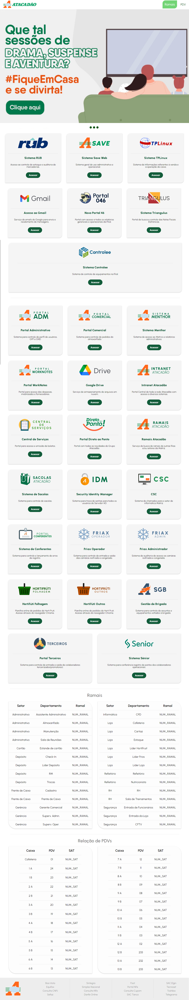

# Atacadão Internal Website

This portal was developed with the purpose of serving as a facilitator for Atacadão's employees.


## Decompression

Use 7-Zip to unzip the file and extract it to a new folder.

Or do it through the linux terminal using the following command:

```bash
gunzip [archive_name].zip
```

This command will extract all the contents from within the .zip file so remember to extract it into a new folder.

## Installing

Import the extracted folder into your database, changing - if necessary - the appropriate paths.

## How to use

Copy the path to your page from your database into your browser's address bar. For example:

```
https://[servername]/[main_dir]/[portal_dir]
```

## Contribution

Contributions and improvements are welcome, note and version each change so we can keep the code in order.

## Credits

**Developed by - Gustavo Mello** 

# Project Screenshot (Full Webpage)

